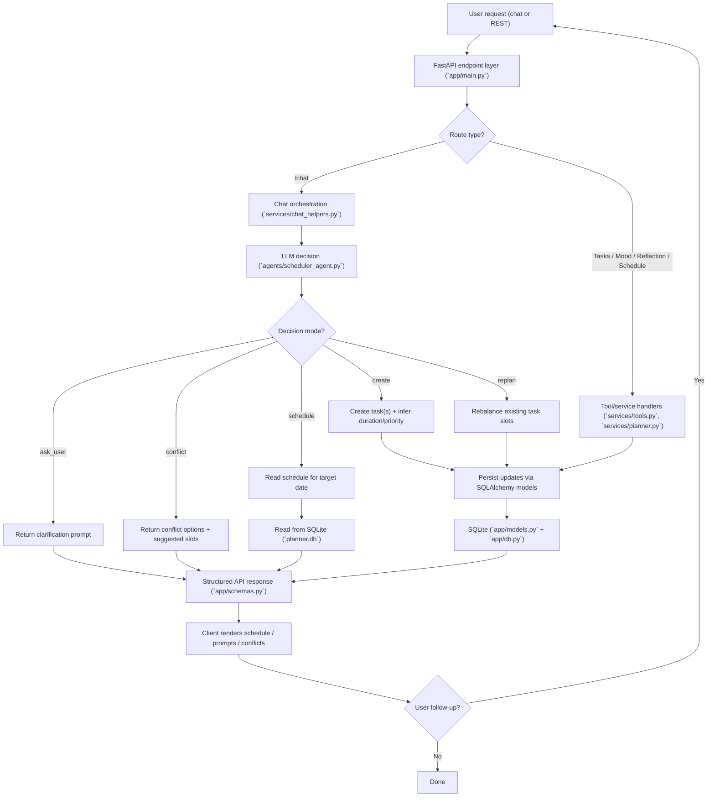

# AI Scheduler

AI Scheduler is a FastAPI backend for planning daily tasks with an LLM-assisted chat interface.

It combines:
- task CRUD APIs
- mood + reflection tracking
- schedule generation and rebalancing
- a conversational `/chat` endpoint that can create, update, and clarify plans

## What This Project Is

AI Scheduler is an intelligent planning backend that turns natural-language requests into actionable daily schedules.  
Instead of manually creating every task and timeslot, you can describe your day in plain English and let the system generate, rebalance, and adapt your plan.

## Why This Is Relevant

Most planners are static: they store tasks but do not reason about changing priorities, time conflicts, energy levels, or follow-up instructions.  
This project is relevant because it combines:
- conversational task planning
- adaptive scheduling based on context
- feedback loops from mood and reflection data

That makes it useful for students and professionals who need a schedule that can evolve throughout the day, not just a fixed to-do list.

## Project Structure

- `backend/app/` - FastAPI app, DB models, and API schemas
- `backend/services/` - scheduling logic, planner logic, chat orchestration, DB tools
- `backend/agents/` - agent wrapper and system prompt
- `backend/tests/` - API and behavior tests
- `backend/planner.db` - local SQLite database file

## Tech Stack

- Python
- FastAPI
- SQLAlchemy
- Pydantic
- SQLite
- OpenAI Chat Completions API
- `dateparser` (natural language date extraction)

## Prerequisites

- Python 3.10+
- OpenAI API key

## Setup

```bash
cd /Users/jeevikakiran/Documents/PersonalLearning/AIScheduler
python3 -m venv .venv
source .venv/bin/activate
pip install fastapi "uvicorn[standard]" sqlalchemy pydantic openai dateparser pytest
```

Set your API key:

```bash
export OPENAI_API_KEY="your_key_here"
```

## Run the API

From the repo root:

```bash
cd backend
uvicorn app.main:app --reload
```

API will be available at:
- `http://127.0.0.1:8000`
- Swagger docs: `http://127.0.0.1:8000/docs`

## API Overview

Main capabilities exposed by the API:
- conversational planning (`/chat`)
- task lifecycle management (create, update, complete, delete)
- day-level schedule retrieval and rebalancing
- mood/reflection capture for adaptive planning
- health and daily summary views

## Project Flow



## Chat Request Example

```bash
curl -X POST http://127.0.0.1:8000/chat \
  -H "Content-Type: application/json" \
  -d '{
    "message": "Plan my day with class from 5 to 7 and two hours coding",
    "chat_thread_id": "thread-1"
  }'
```

The chat response uses modes like `create`, `schedule`, `replan`, `ask_user`, and `conflict`.

## Running Tests

```bash
cd backend
pytest -q
```

## Notes

- The DB URL is currently hardcoded to `sqlite:///./planner.db` in `backend/app/db.py`.
- Tables are created automatically on startup via `Base.metadata.create_all(...)`.
- The agent client initializes at import time and requires `OPENAI_API_KEY` to be set.

## Current Gaps / Improvements

- Add dependency lock files (`requirements.txt` or `pyproject.toml`) for reproducible setup.
- Move config (DB URL, model name, CORS) to environment variables.
- Add a Docker setup for portable local/dev deployments.
- Expand endpoint docs with request/response examples for each route.
